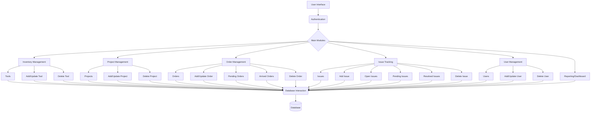

# Inventory Management System: Revolutionizing Resource Control

**Empower Your Business with Unprecedented Control Over Your Assets, Projects, and Operations.**

## Introduction
Welcome to the future of inventory and resource management! The Inventory Management System is not just a tool; it\'s a strategic partner designed to elevate your operational efficiency, minimize waste, and unlock unparalleled productivity. Engineered with precision and a deep understanding of modern business demands, our system offers a holistic solution to conquer the complexities of inventory, project, order, and issue tracking. Say goodbye to spreadsheets and manual errors, and embrace a streamlined, intelligent approach to managing your most valuable assets.

## Key Features
*   **Intuitive & Dynamic Dashboard:** Gain a crystal-clear, real-time overview of your entire operation at a glance. Our beautifully designed dashboard provides instant insights into inventory levels, pending orders, critical issues, and project progress, allowing for data-driven decisions in seconds.
*   **Comprehensive Inventory Management:** Take absolute command of your tools and resources. From real-time stock tracking and detailed item histories to automated low-stock alerts and categorization, our system ensures you always know what you have, where it is, and when you need more. Eliminate stockouts, reduce carrying costs, and optimize your asset utilization like never before.
*   **Streamlined Project Tracking & Allocation:** Seamlessly link your inventory to your projects. Assign tools, track project progress, monitor resource consumption, and ensure every project stays on schedule and within budget. Our system transforms project management from a daunting task into an effortless process.
*   **Effortless Order Management:** From creation to delivery, manage your procurement and sales orders with unparalleled ease. Track pending orders, monitor arrivals, and maintain a complete audit trail of all transactions. Minimize delays, improve vendor relations, and keep your supply chain running smoothly.
*   **Robust Issue Resolution System:** Proactively identify and resolve operational roadblocks. Log issues related to tools, orders, or projects, assign them to team members, and track their resolution status. Our integrated issue management ensures nothing falls through the cracks, maintaining peak operational efficiency.
*   **Secure & Granular User Management:** Control who sees what and who can do what. Our robust user management system allows for the creation of multiple user roles with customizable permissions, ensuring data integrity and operational security at every level.
*   **Intelligent Reporting & Analytics:** Unlock the power of your data. The comprehensive tracking capabilities lay the foundation for powerful reporting, enabling you to analyze trends, forecast demands, and identify areas for continuous improvement, all leading to smarter business decisions.
*   **Scalability & Future-Proof Architecture:** Built on a robust PHP foundation with a well-structured database interaction layer, the Inventory Management System is designed to grow with your business. Its modular architecture ensures effortless expansion and integration with future technologies, safeguarding your investment.

## Why Choose Inventory Management?
In today\'s fast-paced business environment, efficiency is paramount. The Inventory Management System empowers your organization to:
*   **Boost Productivity:** Automate tedious tasks, reduce manual errors, and free up your team to focus on strategic initiatives.
*   **Cut Costs:** Optimize inventory levels, minimize waste, and prevent costly operational delays.
*   **Enhance Decision-Making:** Access real-time data and insightful analytics to make informed, proactive business decisions.
*   **Improve Accountability:** Track every asset, order, and issue, fostering a culture of responsibility and transparency.
*   **Future-Proof Operations:** Invest in a solution that adapts and scales with your evolving business needs.

## System Architecture
The Inventory Management System is designed with a clear, modular architecture to ensure scalability, maintainability, and robust performance.

## Technology Stack
This powerful system is built upon the robust and widely adopted PHP scripting language, ensuring reliability and maintainability. It interacts with a backend database (e.g., MySQL, PostgreSQL) to provide persistent, secure, and scalable data storage. The frontend leverages standard web technologies (HTML, CSS, JavaScript) for a responsive and engaging user experience.

## Getting Started
To deploy the Inventory Management System, simply follow these high-level steps (detailed instructions will be provided upon acquisition):
1.  Set up your web server environment (e.g., Apache, Nginx) with PHP support.
2.  Configure your database (e.g., MySQL, PostgreSQL) and import the provided schema.
3.  Place the system files in your web server\'s document root.
4.  Update database connection settings in the relevant configuration files.
5.  Access the system via your web browser and begin revolutionizing your operations!

## Screenshots/Visuals
(Placeholder for engaging screenshots showcasing the intuitive dashboard, inventory lists, project views, and order tracking pages. Visuals will be added to provide a compelling demonstration of the system\'s capabilities.)

## Contact/Support
Ready to transform your inventory and resource management? Contact us today for a personalized demonstration and discover how the Inventory Management System can propel your business forward. Our dedicated support team is ready to assist you every step of the way, ensuring a seamless experience and maximizing your return on investment.
